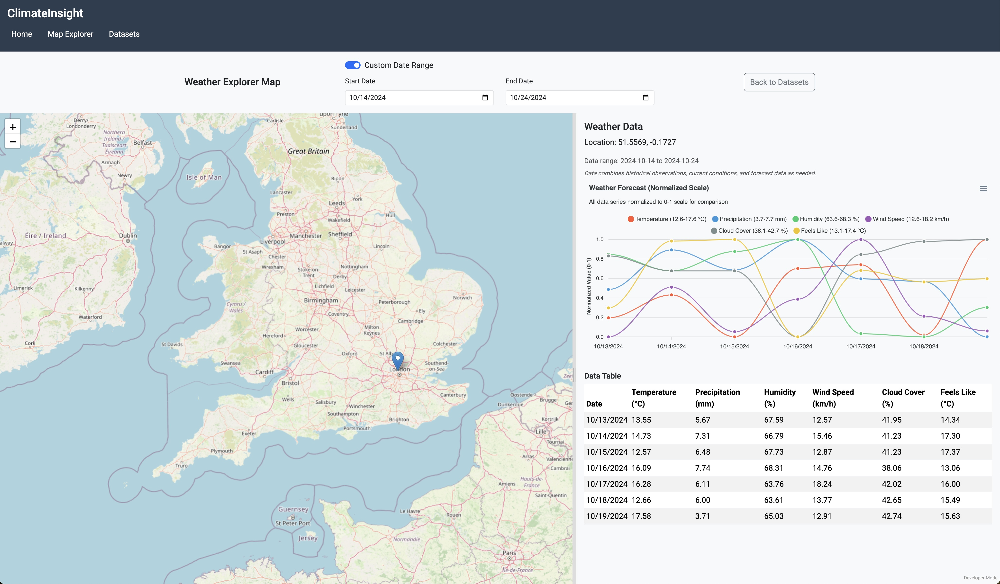

# Weather Map Explorer

Weather Map Explorer is a full-stack React/Node.js application for visualizing weather data through interactive maps and time-series analysis. This project showcases skills in JavaScript/React programming, reactive UI development, and geospatial data processing.

## Features

- **Interactive Maps**: Explore weather data spatially with interactive maps powered by Leaflet JS.
- **Time Series Analysis**: Analyze trends over time with interactive charts showing historical weather data.
- **Multiple Datasets**: Access various weather datasets including temperature, precipitation, and wind patterns.
- **Spatial Queries**: Perform location-based analysis with the Visual Crossing Weather API.

## Technology Stack

- **Frontend**: React.js with Styled Components and Context API for state management
- **Backend**: Node.js with HTTP server
- **Maps**: Leaflet JS integration
- **Weather Data**: Visual Crossing Weather API

## UI

  
The Weather Explorer Map is a React application that allows you to explore weather data spatially. It uses the Visual Crossing Weather API to fetch weather data based on map coordinates and date range.

## Getting Started

### Prerequisites

- Node.js and npm

### Setup

1. Clone the repository:

   ```
   git clone https://github.com/vandyand/weather-insight.git
   cd weather-insight
   ```

2. Start the application:

   ```
   ./start-react-app.sh
   ```

   This script will:

   - Check for any running server instances and stop them
   - Create a `.env` file from the example if needed
   - Install npm dependencies for the frontend
   - Build and deploy the React frontend
   - Start the Node.js server

3. Open your browser at [http://localhost:8080](http://localhost:8080)

## Project Structure

- `/frontend` - React frontend code
  - `/src` - Source code
    - `/components` - UI components
    - `/context` - React Context for state management
    - `/pages` - Page components
    - `/services` - API services
- `/resources` - Static resources
  - `/public` - Public assets (built React app)

## Deployment

To build a production version of the project:

```
cd frontend
npm run deploy
```

Then deploy the contents of the `resources/public` directory to any static web server, along with the Node.js server.

## License

This project is licensed under the MIT License - see the LICENSE file for details.

## Acknowledgements

- Weather data provided by Visual Crossing Weather API
- Leaflet JS for their mapping platform
